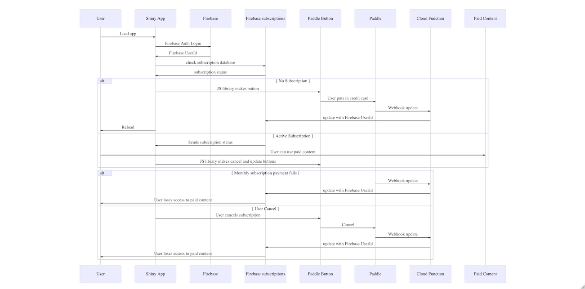

# Creating a paid R SaaS with Firebase, Paddle and Shiny

Create a template for R users to create paid subscription services for Shiny Apps.

## Many thanks to...

This project is derived from:

* https://www.tychobra.com/posts/2019-01-03-firebasse-auth-wtih-shiny/
* Firebase [AuthUI](https://firebaseopensource.com/projects/firebase/firebaseui-web/)
* An early iteration inspired some of this package https://github.com/JohnCoene/firebase which it now uses for firebase auth

## Payment strategy



## Steps to Run the Shiny App

1. Download or clone this repository
2. Create a [Firebase](https://firebase.google.com/) account and setup as per https://firebase.john-coene.com/articles/get-started.html
3. Create a [Paddle](https://paddle.com) account and subscription as per https://developer.paddle.com/getting-started/intro
4. Create env args:

```
FIREBASE_API_KEY=your-api-key
FIREBASE_PROJECT=your-firebase-project
GAR_CLIENT_JSON=file-location-of-client-id
PADDLE_VENDOR=paddle-vendor-id
```

5. When you create a Paddle subscription it gives you a productId - this should be unique for each Shiny app and is placed at the top of server.R in the `PADDLE_PRODUCT_ID` global arg.
6. Deploy the Cloud Function in `payment_app/fb_functions` in the same Firebase project via the GCP console.  This handles communication between Firebase and Paddle webhooks.

The functions in `global.R` take care of Shiny communicating with the Firebase database and Paddle

## Running the payment app

The Shiny App will offer to link to the payment popup via Paddle after login with Firebase Auth.  The firebase auth ID is used to verify if the user has an existing subscription, and if not creates a payment button to do so.  If a user does have a subscription, then they see the paid content. 

If a subscription fails (the credit card is cacnelled or similar) then Paddle updates.

The Firebase databsae "subscriptions" is used to keep track of whether a user has paid or not.  The communication between Firebase and PAddle is done via the Python cloud function in the `payment_app/` folder - see its [README for details](https://github.com/MarkEdmondson1234/Shiny-R-SaaS/tree/master/payment_app).

