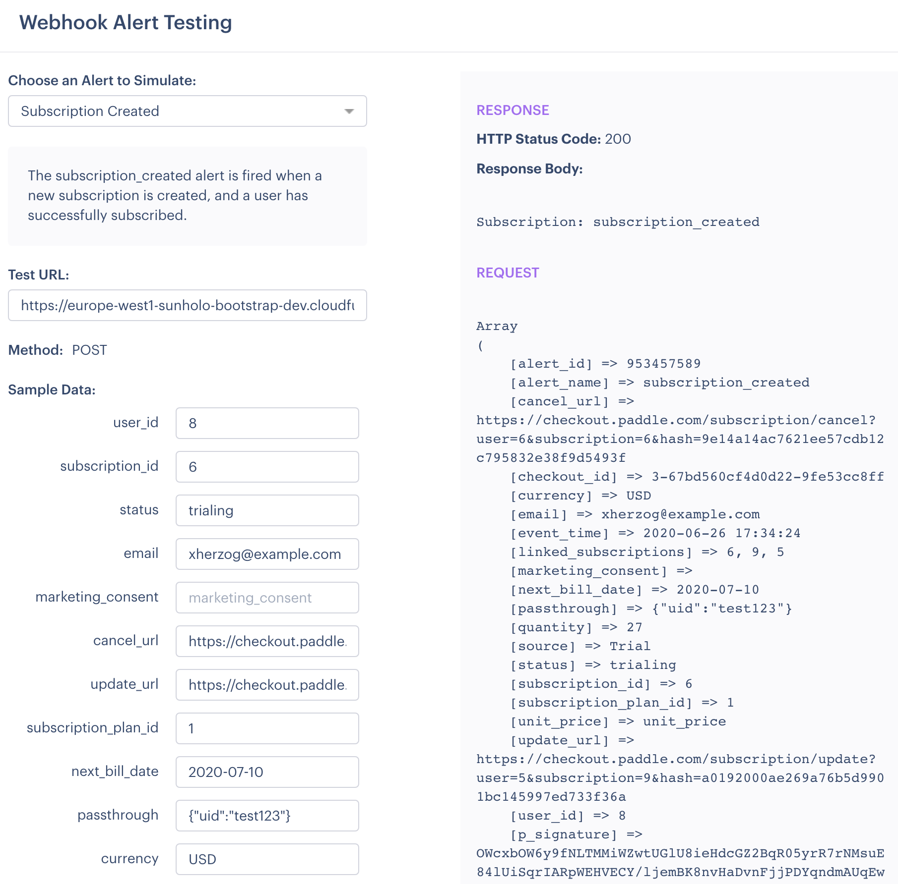

## Payment app

This holds code for handling the transactions: Firebase Auth handles the userId, Paddle the subscription status and Cloud Functions handles the communication between them.

### Paddle

Payments are using [Paddle.com](https://paddle.com/) - when a payment goes through paddle it will send a webhook request to the Firebase functions as described in folder `payment_app/fb_functions/`

The [Paddle webhook docs](https://developer.paddle.com/webhook-reference/intro) give some detail on what they do.

Each time a user subscribes via the JavaScript library, a webhook will be sent to the URL you get when you deploy the Cloud Function.

### Cloud Function

The python3.7 code in `payment_app/fb_functions/` will create a webhook endpoint.  Create it in the same project as the Firebase authentication if used.

See [here on how to deploy the code to Google Cloud Functions](https://cloud.google.com/functions/docs/concepts/python-runtime) - you can use `gcloud` or paste it straight into the web console.  The function to execute is `paddle`


The HTTP endpoint will be given to you after deployed - use that within Paddle as the webhook.  It covers the Paddle events:

```python
    sub_events = ['subscription_created',
                  'subscription_updated',
                  'subscription_cancelled']
```

The Cloud Function creates a Firebase dataset called "subscriptions" with the document Id of the uid found in the "passthrough" field in the webhook.  This passthrough will be set to a JSON string like so:

```json
{"uid":"your-user-id"}
```

This is the format the R code uses to identify which Firebase user has which subscription.

The code includes a verification step, which verifies the webhook is coming from Paddle.  To pass the step, you need to paste in your Public key as detailed in [verifying webhooks](https://developer.paddle.com/webhook-reference/verifying-webhooks) and is found in your seller dashboard.
 
## Testing

You can test the webhook here: https://vendors.paddle.com/webhook-alert-test

The tests will need the `passthrough` field filled in with a uid json string as above.  The webhook triggers for subscription created, subscription updated and subscription cancelled webhooks.



If working you should see the subscription data propagate to your Firebase console database at https://console.firebase.google.com/

The example below is for the test webhook given above:


This database is read from the Shiny app to check a user's subscription.

There is also an `event` collection for each user which contains all historic updates (creation, updates, cancellations).  

The Shiny app will check that the status is not "deleted" indicating a lapsed subscription.
